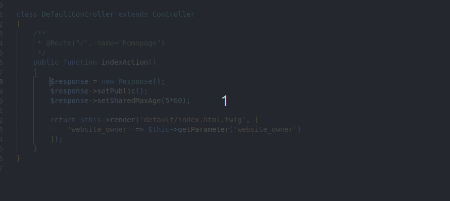
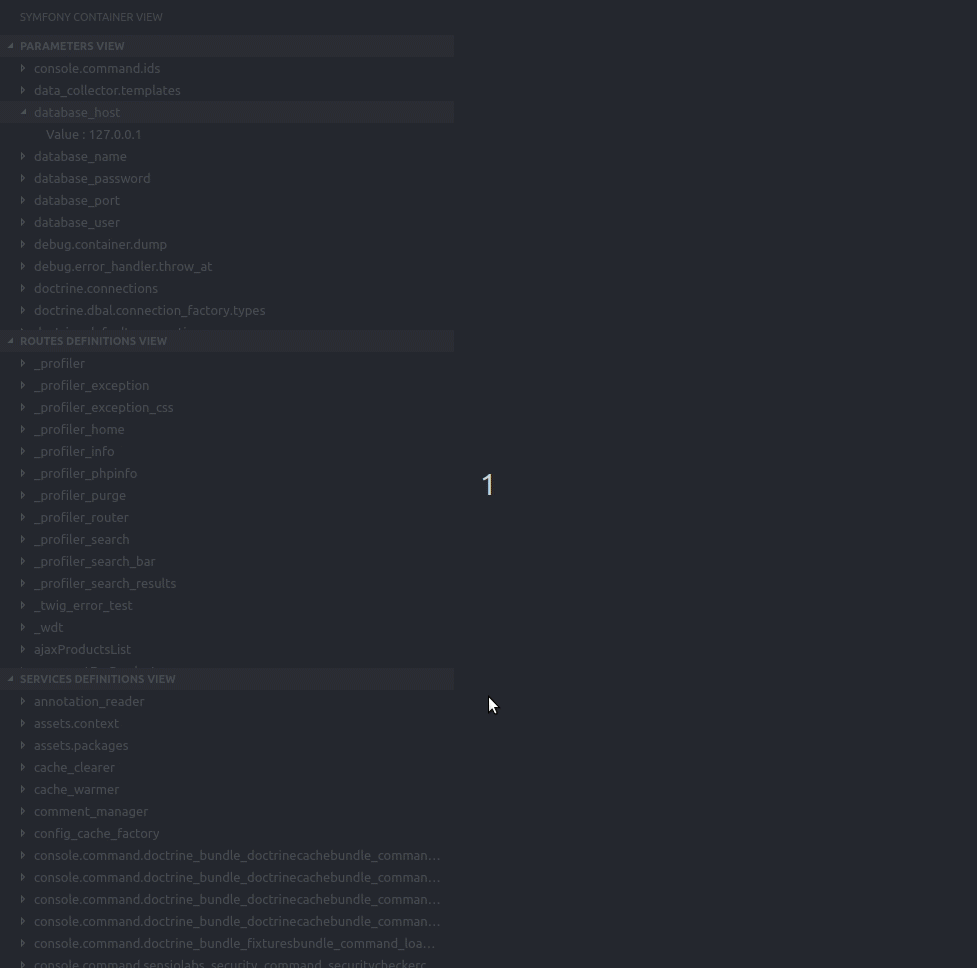

# Symfony for VSCode

This extension aims to help developing Symfony2+ projects, by providing basic autocompletion and visualization of the Symfony container.

## Features

This extension provides the following features :
* Autocompletion in YML and XML files of services and parameters
* Hover details on services and parameters name
* Go to implementation of a service
* A custom view to visualize the current project container, with services, routes and parameters

## How does it works ?

To detect Symfony projects, this extension rely on `composer.json` files with `symfony/symfony` as one of its dependencies.

The `composer.json` file is supposed to be at the root of your Symfony project.

When the project is detected, it simply uses the `debug:container` and `debug:router` console commands to hydrate the views and autocompletions.

## Extension settings

Here are the settings that can be overridden for convenience :
* `phpExecutablePath`: Path to the PHP executable. This path is ignored if the `shellExecutable` parameter is different than false (default value : `/usr/bin/php`).
* `shellExecutable`: The shell executable path. If differant that false, console commands will be called via shell instead of just calling the PHP executable. Useful for particular setup, such as Dockerized projects (default value : `false`).
* `shellCommand`: The shell command. Only used when calling the shell to do console commands. Useful for particular setup, such as Dockerized projects (default value : `false`).
* `consolePath`: Path to the Symfony console, relative to the root directeory. If null, the extension try to guess the path with the Symfony version from the composer.json file (default value : `null`).
* `showConsoleErrors`: If false, the extension doesn't show error messages caused by compilation errors (default value : `true`).
* `enableFileWatching`: If false, the extension refresh automatically when a YAML file is modified (default value : `true`).
* `fileWatchingPatterns`: Files with one of these extensions will trigger a container refresh on save. By default, watches only `*.yml` and `*.xml` files.
* `servicesFilters`, `routesFilters` and `parametersFilters` : Filters out container elements. Filtered elements doesn't show in the Symfony view, nor does they appear in autocompletion.

## Various environments

If your Symfony app is not running on a conventional installation (for example, you are running a Symfony app on a Docker container), you can find different configuration recipes [here](ENVIRONMENTS.md).

## Contribution

If you want to contribute to this extension, everything you want to know is [here](CONTRIBUTING.md).

## Release Notes

See [the changelog](CHANGELOG.md) for releases notes.

## Acknowledgments

Icons from www.flaticon.com, by :
* [Chanut](https://www.flaticon.com/authors/chanut)
* [SimpleIcon](https://www.flaticon.com/authors/simpleicon)